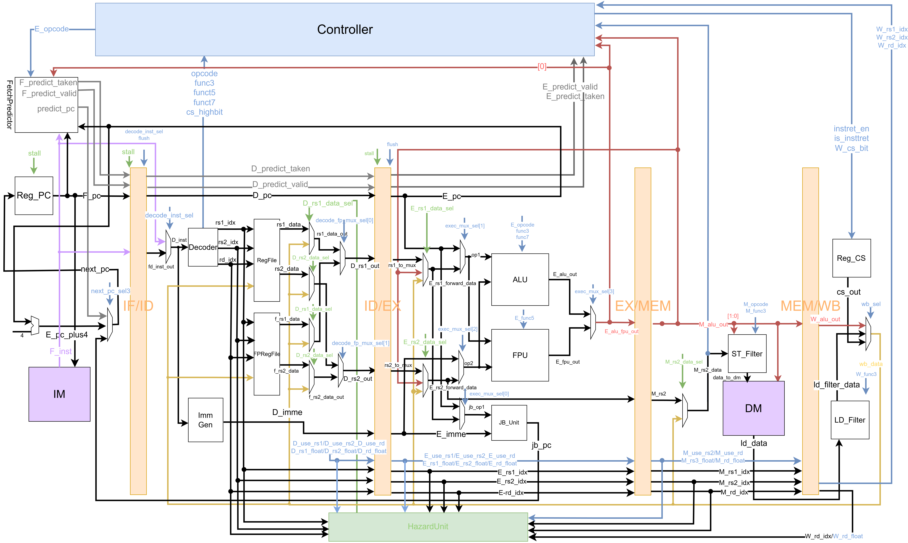
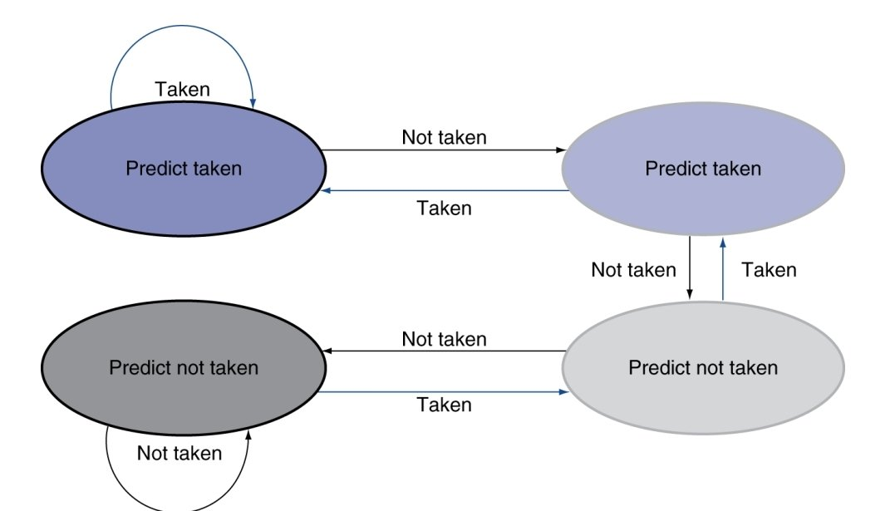

# HW1 - RISC-V Pipelined CPU with Floating-Point Support

## Overview

This project implements a 5-stage pipelined RISC-V CPU (IF → ID → EX → MEM → WB) with floating-point unit (FPU) support. The design features a **bimodal branch predictor** to reduce branch penalties, along with **data forwarding** and **hazard detection** to efficiently handle pipeline hazards.

### Instruction Support

The CPU implements **49 RISC-V instructions** across multiple categories:

- **Arithmetic & Logic**: add, sub, mul, mulh, mulhu, mulhsu, and, andi, or, ori, xor, slt, slti, sltu, sltiu
- **Shift Operations**: sll, slli, srl, srli, sra, srai
- **Branch & Jump**: beq, bne, blt, bge, bltu, bgeu, jal, jalr
- **Memory Access**: lw, sw, lb, sb, lh, sh, lbu, lhu
- **Immediate Operations**: addi, slti, ori, andi, xori
- **Floating-Point**: flw, fsw, fadd.s, fsub.s
- **U-Type Instructions**: lui, auipc
- **CSR/Counter Instructions**: rdinstreth, rdinstret, rdcycleh, rdcycle

## CPU Architecture

### CPU Block Diagram



## Branch Predictor

### 2-bit Saturating Counter Predictor

This CPU implements a **2-bit saturating counter** branch predictor to reduce branch penalties.



## Floating-Point Unit (FPU)

### IEEE 754 Single-Precision Support

The FPU implements IEEE 754 single-precision (32-bit) floating-point addition and subtraction in a single-cycle combinational design.

#### Supported Operations
- **FADD.S**: Floating-point addition
- **FSUB.S**: Floating-point subtraction (implemented as addition with sign flip)

### FPU Processing Steps

1. **Unpack & Extend**: Extract sign/exponent/fraction, add hidden bit `{(e!=0), f[22:0]}`
2. **Preprocessing**: Handle FSUB sign flip, compare magnitudes and swap to ensure larger operand as base
3. **Alignment**: Shift smaller operand right by exponent difference, add Guard/Round/Sticky bits
4. **Add/Subtract**: Execute `fb_ext ± fs_shifted` based on effective signs (28-bit result)
5. **Normalize & Round**: Apply LZC for subtraction or handle carry for addition, then Round-to-Nearest-Even
6. **Pack**: Combine into IEEE 754 format `{sign, exp[7:0], frac[22:0]}`

## Hazard Handling

### Data Hazards
- **Forwarding Unit**: Forwards data from EX/MEM/WB stages to avoid stalls
- **Integer and Float Forwarding**: Separate paths for integer and FP registers
- **Load-Use Hazard**: Pipeline stall inserted when needed

### Control Hazards
- **Branch Prediction**: Reduces branch penalty with 2-bit predictor
- **Misprediction Recovery**: Flush pipeline and redirect PC
- **Predictor Update**: Updates on branch resolution in EX stage

## File Structure
```
HW1/
├── src/
│   ├── CPU.sv              # Top-level CPU module (5-stage pipeline)
│   ├── FPU.sv              # Floating-point unit (FADD/FSUB)
│   ├── BranchPredictor.sv  # 2-bit saturating counter predictor
│   ├── FetchPredictor.sv   # Branch prediction integration
│   ├── HazardUnit.sv       # Hazard detection and forwarding
│   ├── RegFile.sv          # Integer register file (x0-x31)
│   ├── FPRegFile.sv        # FP register file (f0-f31)
│   ├── ALU.sv              # Integer ALU
│   ├── Decoder.sv          # Instruction decoder
│   ├── Controller.sv       # Control signal generation
│   ├── Imm_Gen.sv          # Immediate generator
│   ├── JB_Unit.sv          # Jump/Branch unit
│   ├── LD_Filter.sv        # Load data filter (byte/half/word)
│   ├── ST_Filter.sv        # Store data filter
│   └── Reg_*.sv            # Pipeline registers (PC, IF/ID, ID/EX, EX/MEM, MEM/WB)
├── sim/
│   ├── top_tb.sv           # Testbench
│   └── prog*/              # Test programs
├── script/
│   ├── synthesis.tcl       # Synthesis script
│   └── superlint.tcl       # Linting script
└── include/
    └── defines.svh         # System parameters and definitions
```

## Performance Considerations

### Branch Prediction Impact
- **Correct Prediction**: 0 cycle penalty
- **Misprediction**: 3 cycle penalty (flush IF/ID/EX stages)
- Predictor accuracy depends on branch patterns

