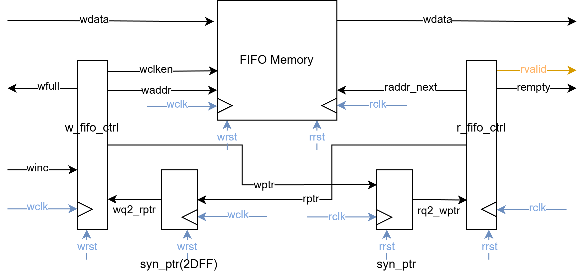

# HW4 - AXI-Based SoC with Multi-Clock Domain Design

## Overview

This project extends the RISC-V CPU from HW1 into a complete System-on-Chip (SoC) with AXI4 interconnect, operating across multiple clock domains. The system integrates L1 caches, DMA controller, watchdog timer, ROM, and DRAM, connected via an AXI bus with asynchronous FIFO (AFIFO) for clock domain crossing.

## System Architecture


### Key Components

#### CPU Wrapper
- **RISC-V CPU Core**: 5-stage pipelined processor from HW1
- **L1 Instruction Cache (L1C_I)**: Direct-mapped, read-only cache for instruction fetch
- **L1 Data Cache (L1C_D)**: Direct-mapped, write-through cache with read-allocate policy
- **Clock Domain**: `cpu_clk` (independent from AXI bus clock)

#### AXI4 Interconnect
- **Masters**:
  - **M0**: Instruction Memory Master (from L1C_I)
  - **M1**: Data Memory Master (from L1C_D)
  - **M2**: DMA Master - for memory-to-memory transfers
- **Slaves**:
  - **S0**: ROM Slave - boot code and immutable instructions
  - **S1**: Instruction Memory Slave
  - **S2**: Data Memory Slave 
  - **S3**: DMA Slave - for CPU to configure DMA transfers
  - **S4**: Watchdog Timer Slave - system monitoring
  - **S5**: DRAM Slave - main system memory
- **Clock Domain**: `axi_clk` (independent from CPU clock)

## L1 Cache Design

### L1 Instruction Cache (L1C_I)
- **Policy**: Read-only, read-allocate on miss

### L1 Data Cache (L1C_D)
- **Write Policy**: Write-through (update cache and memory simultaneously on write hit)
- **Allocation Policy**: 
  - **Read Miss**: Read-allocate (load block into cache)
  - **Write Miss**: Write no-allocate (write directly to memory, bypass cache)

## Asynchronous FIFO (AFIFO)

### Purpose
The AFIFO bridges clock domain crossings between the CPU subsystem (cpu_clk) and AXI interconnect (axi_clk), ensuring reliable data transfer across asynchronous clock domains.



### Key Features

**Gray Code Pointers**
- Write/read pointers use Gray code encoding (only 1 bit changes per increment)
- Minimizes metastability risk when crossing clock domains
- Conversion: `Gray = Binary ^ (Binary >> 1)`

**Two-Stage Synchronizers**
- Pointers synchronized across domains using 2 flip-flops
- `wq2_rptr`: Read pointer → write domain 
- `rq2_wptr`: Write pointer → read domain

**Full/Empty Detection**
- **Full**: Write pointer catches read pointer (Gray code: top 2 MSBs inverted, rest identical)
- **Empty**: Read pointer catches write pointer (Gray code: all bits identical)

**Control Logic**
- **Write**: Check `wfull` → write data → increment binary pointer → convert to Gray code
- **Read**: Check `rempty` → read data → increment binary pointer → convert to Gray code
- Binary pointers generate memory addresses; Gray pointers enable safe cross-domain comparison

**Reset Synchronizers** convert active-high resets to active-low, ensuring proper reset sequencing across domains.

## File Structure

```
HW4/
├── src/
│   ├── top.sv                    # Top-level SoC integration
│   ├── CPU/
│   │   ├── CPU.sv                # RISC-V CPU core
│   │   ├── CPU_wrapper.sv        # CPU wrapper with L1 caches
│   │   ├── L1C_inst.sv           # L1 instruction cache
│   │   ├── L1C_data.sv           # L1 data cache
│   │   ├── IM_Master.sv          # Instruction memory AXI master
│   │   └── DM_Master.sv          # Data memory AXI master
│   ├── AXI/
│   │   ├── AXI.sv                # AXI interconnect top
│   │   ├── AR.sv, AW.sv, R.sv, W.sv, B.sv  # AXI channel modules
│   │   ├── Arbiter.sv            # Master arbitration logic
│   │   ├── Decoder.sv            # Slave address decoder
│   │   └── AFIFO/
│   │       ├── FIFO.sv           # Async FIFO top module
│   │       ├── w_fifo_ctrl.sv    # Write pointer control
│   │       ├── r_fifo_ctrl.sv    # Read pointer control
│   │       ├── syn_ptr.sv        # 2-FF synchronizer
│   │       └── fifo_memory.sv    # Dual-port memory
│   ├── DMA/
│   │   ├── DMA_wrapper.sv        # DMA controller wrapper
│   │   ├── DMA_Master.sv         # DMA AXI master interface
│   │   └── DMA_Slave.sv          # DMA AXI slave interface
│   ├── WDT/
│   │   ├── WDT.sv                # Watchdog timer logic
│   │   └── WDT_wrapper.sv        # WDT AXI slave wrapper
│   ├── ROM/                      # ROM controller
│   ├── DRAM/                     # DRAM controller
│   ├── IM_DM/                    # Instruction/Data memory
│   └── Reset_Sync.sv             # Reset synchronizer
├── sim/
│   ├── top_tb.sv                 # System testbench
│   └── prog*/                    # Test programs
├── include/
│   ├── AXI_define.svh            # AXI protocol parameters
│   └── def.svh                   # System-wide definitions
└── script/
    ├── synthesis.tcl             # Synthesis script
    └── Spyglass_CDC.tcl          # CDC verification script
```
